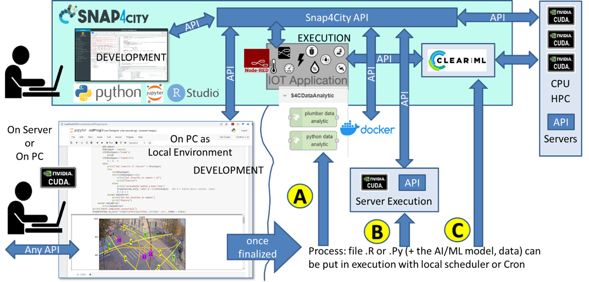
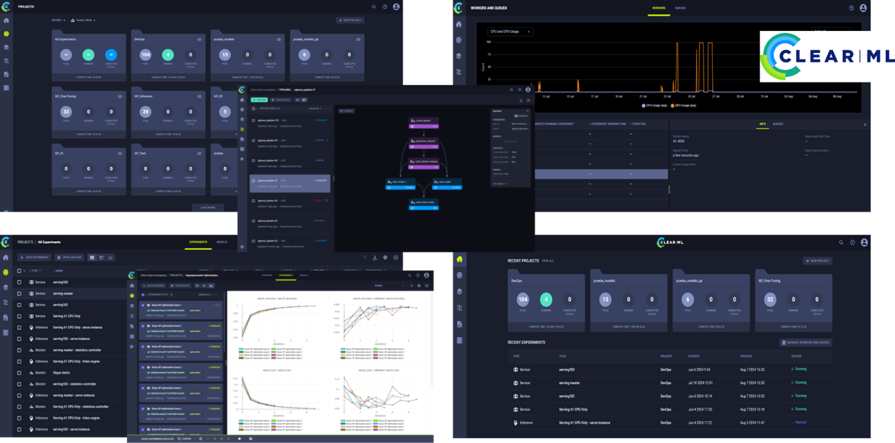

# MLOps in Snap4City

## Overview

The management of AI/ML operation/development (MLOps) in Snap4City involves two main activities:

- **Training**: Involves running several processes with different parameters and models to be trained, validated, and tested in batches to find the best results with respect to specific metrics. This is computationally expensive and time-consuming, especially if processes need to be manually sent to GPU/CPU.
- **Execution**: Typically involves single executions, which are generally cheaper individually but can become expensive when dealing with a large volume of executions. Execution needs can be split into:
  - **Periodic Predictions**: Saving time if the model is loaded permanently.
  - **On-Demand Execution**: Used for optimization, clustering, etc. This requires loading the model, which is time-consuming.

## Training Processes in Snap4City

Training processes can be carried out in the following environments:

- **Jupyter HUB provided by Snap4City**: In Python using ASCAPI, available on either a CPU or CPU/GPU server.
- **ClearML**: Used for both Training and Execution on a GPU/CPU cluster.
  - Only the Snap4City Jupyter HUB can access ClearML and the GPU/CPU cluster.
  - Access to ClearML facilities requires authorization from the Snap4City Administrator.
- **External Jupyter HUB**: Using ASCAPI in Python, but without access to Snap4City's CPU/GPU resources.
- **Local Environment**: On your own computer in Python using ASCAPI, without access to Snap4City's cloud CPU/GPU resources.

## Execution of AI Models in Snap4City

Developers can create their AI models using Snap4City data and infrastructure (Jupyter Hub) and put them into execution in the following ways:

### Option 1: On Your Environment
- **Stable Container on CPUs**: Deploy via Node-RED and Docker using the Snap4City Node-RED library for developers.
- **Direct Manual Operation**: On a server with GPU/CPUs.

### Option 2: Using Snap4City Nodes for ClearML
- **Option 2a: Stable Process on ClearML** 
  - Managed Docker via API (usable from REST calls as well as from Node-RED Snap4City MicroServices).
- **Option 2b: Sporadic Process on ClearML**
  - Managed via API (usable from REST calls as well as from Node-RED Snap4City MicroServices).

## ClearML Features

ClearML offers the following main features:

- **Experiment Tracking**: Provides advanced features for experiment tracking, including automatic logging of metrics, output, source code, and the execution environment. This ensures that each experiment is reproducible, and its results are easily shareable and comparable.
- **Data and Model Management**: Provides tools for efficient management of datasets and models, allowing for easy versioning, archiving, and sharing. Users can track model versions and easily associate them with corresponding experiments.
- **Integration and Compatibility**: ClearML is designed to integrate with existing development environments and tools, such as Jupyter Notebooks, TensorFlow, PyTorch, and many others, thus supporting a wide variety of workflows and technology stacks.
- **User Interface and Dashboard**: Offers an intuitive dashboard that allows users to monitor the status of experiments in real time, view metrics and outputs, and manage resources and execution queues, all from a single interface.
- **Automation and Orchestration**: Allows the remote execution of experiments on any machine and distributes the tasks according to a system of queues and priorities. Also, it automates hyper-parameterization via Optuna.

